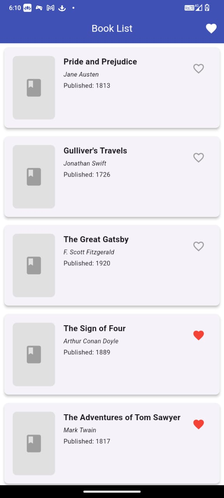
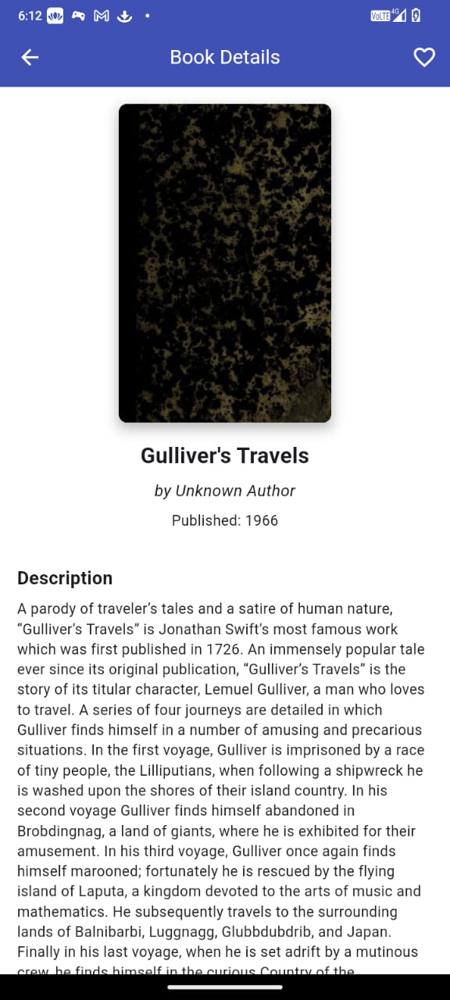
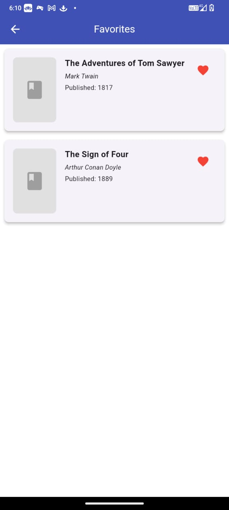

# MyBooks Flutter Application

A Flutter application that allows users to explore novels, view details, and save favorites locally.

## Features

* Browse a paginated list of novels from the Open Library API
* View detailed information for each book
* Mark/unmark books as favorites (locally stored)
* Dedicated favorites screen with the ability to remove favorites

## Screenshots

### Home Screen


### Book Detail Screen


### Favorite Screen


## Getting Started

### Prerequisites

* Flutter SDK (version 3.0.0 or higher)
* Dart SDK (version 3.0.0 or higher)
* An internet connection for fetching book data

### Installation

1. Clone this repository:

```
git clone https://github.com/your-username/mybooks.git
```

2. Navigate to the project directory:

```
cd mybooks
```

3. Get dependencies:

```
flutter pub get
```

4. Run the app:

```
flutter run
```

## Architecture and Design Decisions

### Project Structure

The application follows a modular architecture with clear separation of concerns:

* **models/**: Data models and state management
* **screens/**: UI screens and navigation
* **services/**: API integration and external service interactions
* **utils/**: Utility functions and constants
* **widgets/**: Reusable UI components

### State Management

The app uses Provider for state management, which offers several benefits:

* Centralizes the application state
* Provides an efficient way to update the UI when data changes
* Allows for easier testing and maintenance
* Follows the recommended approach for Flutter applications

### API Integration

The app integrates with the Open Library API to fetch book data:

* Books are fetched in a paginated manner to optimize performance
* The API service is abstracted to handle response parsing and error management
* Detailed book information is fetched on demand when viewing a specific book

### Local Storage

Favorites are stored locally using SharedPreferences:

* Provides persistence across app restarts
* Efficiently stores simple data structures
* Native to Flutter and doesn't require additional dependencies

### Error Handling

The application implements comprehensive error handling:

* Centralized error handling service
* User-friendly error messages with retry options
* Graceful degradation when services are unavailable

## Dependencies

* **provider**: For state management
* **http**: For API requests
* **shared\_preferences**: For local storage of favorites
* **cached\_network\_image**: For efficient image loading
* **flutter\_spinkit**: For loading indicators
* **flutter\_lints**: For code quality enforcement

## Future Improvements

Potential enhancements for future versions:

1. Implement search functionality
2. Add filtering options (by genre, author, etc.)
3. Support for dark mode
4. Implement caching for offline access
5. Add user authentication for cloud syncing of favorites
6. Implement more comprehensive unit and widget tests

## Contributing

Contributions are welcome! Please feel free to submit a Pull Request.

## License

This project is licensed under the MIT License - see the LICENSE file for details. i want to short little bit
